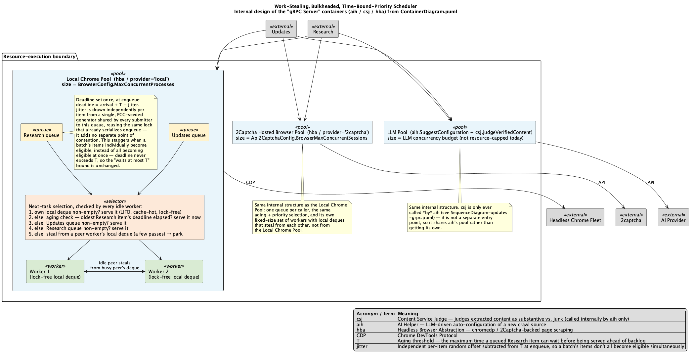

# scheduler

A work-stealing task scheduler, bulkheaded by resource kind: one pool
per kind of work (`Kind` — LLM calls, plain fetch, proxy fetch, local
headless-browser renders, remote-hosted headless-browser renders), each
a fixed pool of workers with its own lock-free local queue that steal
work from one another when their own queue runs dry. Within a pool,
submitted tasks carry a `Priority`, served in order but with a bounded
worst-case wait for the lower-priority queue.

The diagram covers this package's actual queue/worker/aging mechanics (the
selector's task-selection order and the deadline/jitter behavior). The
surrounding `aih`/`csj`/`hba` containers and pool wiring it depicts belong to
a different service that consumes this package — nothing outside
`internal/scheduler` in this repo wires up `Kind`s yet.

## Why bulkheaded, work-stealing, and priority-aware

**Bulkheading.** A single shared pool spanning every resource kind has
a specific failure mode: a worker that picks up a task needing a scarce
external resource (a browser session, a proxy slot) blocks *inside that
task* waiting to acquire it, while still counting as "busy" from the
pool's point of view. A burst of that resource-hungry kind can pin most
of the pool, starving cheap, fast kinds that don't need that resource at
all — and no amount of queue reordering fixes this, because the problem
is workers being occupied, not queue order. Giving each `Kind` its own
`Scheduler`, sized to that resource's real capacity, makes this
impossible by construction: a `Kind` with 2 real backing slots gets a
2-worker pool, so a burst against it can never consume a worker that
belongs to a different `Kind`.

**Work-stealing**, within one `Kind`'s pool, is the usual case for a
task pool: a single shared queue means every worker and every submitter
contends on one mutex; static partitioning means no rebalancing. Per-
worker queues get the throughput of "a worker touching only its own
queue never contends with anyone" while still load-balancing, because
an idle worker can reach into a busy peer's queue instead of sitting
idle. It's also the natural fit for *recursive* work — see
[Nested spawning](#nested-spawning-and-context).

**Priority with aging**, also within one `Kind`'s pool, solves a
different problem: multiple callers sharing that pool's capacity. An
unprioritized FIFO lets whichever caller submits first, or in bulk,
delay a different caller's steady, latency-sensitive traffic — even
when that traffic is supposed to get the majority of the resource.
`PriorityStandard` is served first; `PriorityBackground` is served
after it, except that a `PriorityBackground` task waiting past the
pool's configured `AgingThreshold` is served immediately, bounding its
worst-case wait regardless of how much `PriorityStandard` work keeps
arriving.

## How it works

### The local deque and stealing (unchanged from a single-pool design)

Each worker owns a **Chase-Lev deque** (`deque.go`): a fixed-capacity,
lock-free ring buffer built on two atomic indices, `top` and `bottom`.

- The **owner** pushes and pops at the **bottom**, LIFO. This is the hot
  path — pure atomic loads/stores/CAS, no mutex, zero allocations.
- **Thieves** (any other worker *in the same pool*) pop from the **top**,
  FIFO — stealing the *oldest* task, leaving the owner's own
  recently-pushed work (and its cache locality) alone. A pool never
  steals across a `Kind` boundary; that boundary is the entire point of
  bulkheading.

### Reaching a worker's queue

1. **External submission**, via one of the named `SubmitXxx` functions
   in `kinds.go` (or `Submit` directly for ad-hoc use). There's no
   worker to own the task locally, so `priority` selects one of the
   pool's two shared queues:
   - `PriorityStandard` → the **standard queue** (`injector.go`), a
     plain mutex-protected FIFO.
   - `PriorityBackground` → the **background queue** (`aging.go`), a
     FIFO where every pushed task also gets a deadline (see
     [Priority, aging, and jitter](#priority-aging-and-jitter)).
2. **Nested spawning.** A task already running *on* a worker calls
   `Submit` again to spawn a child. That child is pushed straight onto
   the *spawning* worker's own local deque — `priority` is ignored on
   this path, since there is no queue contention to arbitrate between a
   worker and itself.

A worker's main loop (`worker.go`) looks for work in this order:

1. its own local deque (LIFO, cache-hot);
2. the background queue's oldest task, **only if** its aging deadline
   has elapsed;
3. the standard queue;
4. the background queue's oldest task **unconditionally** — once the
   standard queue is empty, background work runs at full speed whether
   it's aged or not;
5. stealing from a peer *in the same pool* (random start index, one
   pass over every peer).

If all of that comes up empty across a few retries, the worker parks on
a buffered "doorbell" channel instead of spinning, woken the instant any
push happens anywhere in its pool.

`Submit` (and each `SubmitXxx`) returns a `Future[T]`; call `.Wait()` to
block for the `Result[T]{Value, Err}`.

### Nested spawning and context

`Func[T]` (which every named `XxxFunc` type in `kinds.go` wraps) takes a
`context.Context` as its first argument. That context is how a running
task discovers "I'm on worker N of this pool" — the scheduler tags it
via `context.WithValue` before invoking the task, and a nested `Submit`
call that receives that same context routes to worker N's own deque
instead of a shared queue (see `workerFromContext` in `worker.go`). A
task that wants to fan out simply captures the `*Scheduler` (or
`*Bulkhead`, to spawn into a *different* `Kind`'s pool) and calls
`Submit`/`SubmitXxx` from inside itself — no separate "spawner" API
needed. Spawning into a different `Kind` always goes through that
pool's shared queues, never the local deque — the local-deque fast path
only applies to same-pool recursion.

### Overflow

A local deque has a fixed capacity (256 by default) because a genuinely
lock-free *resize* is a much harder algorithm than this scheduler
currently needs. If a worker's own deque is full when it tries to push
a child, that push spills to the pool's shared queues instead of
blocking.

## Bulkheading and Kind

`Kind` (`bulkhead.go`) names the five resource kinds this package knows
about: `KindLLM`, `KindFetch`, `KindProxyFetch`, `KindChromedp`,
`KindTwoCaptcha`. `KindChromedp` and `KindTwoCaptcha` look similar — both
drive a headless browser — but are deliberately separate `Kind`s,
because they're backed by two independent external resources with their
own, unrelated capacity: a locally-hosted browser pool vs. a remote,
hosted-browser API. Treating them as one `Kind` would let a burst
against either one starve the other, which is exactly the failure mode
bulkheading exists to prevent.

`Bulkhead` owns one `Scheduler` per `Kind`. `NewBulkhead` requires a
`Config` for every `Kind` in `AllKinds()` and returns an error if one is
missing, rather than silently defaulting it — a resource pool sized by
accident (e.g. falling back to `runtime.NumCPU` workers for a 2-session
browser pool) is precisely the bug bulkheading exists to prevent, so a
missing entry fails loudly at construction instead of quietly at
runtime.

Each `Kind` gets a matching pair of types and a `SubmitXxx` function in
`kinds.go` (e.g. `LLMFunc`/`LLMResult`/`SubmitLLM`) — thin wrappers
around the generic `Func[T]`/`Submit`, so callers work with named,
kind-specific types rather than bare generics, while the underlying
machinery (and the option to use `Submit` directly for something outside
the five known kinds) stays available.

## Priority, aging, and jitter

`Priority` (`priority.go`) has two values. `PriorityStandard` wins every
priority check it's present for — by construction, since it's checked
before `PriorityBackground` in the selection order above. That means
`PriorityStandard` never needs, or gets, any special treatment to avoid
starvation: it's never the one at risk.

`PriorityBackground` is the one that needs a bound. `Config.AgingThreshold`
caps how long a `PriorityBackground` task can wait once queued, and
`agingQueue.push` (`aging.go`) records a deadline of `now + AgingThreshold`
for every task at the moment it's enqueued. `worker.findTask`'s step 2
serves the oldest background task the instant that deadline elapses,
ahead of whatever the standard queue has waiting.

**Jitter** (`Config.AgingJitter`) exists for one specific failure mode:
a large batch of `PriorityBackground` tasks submitted at once would, on
a bare threshold, all become eligible at exactly the same instant —
turning aging's "one item jumps the queue" guarantee into "the entire
batch floods through in a burst" the moment the threshold elapses. Each
task's deadline instead gets an independent random amount in
`[0, AgingJitter]` subtracted from it, spreading a same-instant batch's
eligibility across `[now+threshold-jitter, now+threshold]` instead of
collapsing it onto one point. Jitter only ever pulls a deadline earlier,
never later, so `AgingThreshold`'s bound is never widened — it's a
smoothing effect on *when within the bound* a task becomes eligible, not
a change to the bound itself.

The jitter random source is deliberately *not* its own synchronized
resource: `agingQueue.rng` is touched only inside `push`, while
`agingQueue.mu` is already held for the push itself. It piggybacks on a
lock that has to exist anyway, rather than adding a second point of
contention that a many-goroutine bulk-batch insert would otherwise pile
onto — see `BenchmarkAgingQueue_PushPop`, which confirms this costs zero
additional allocations over a plain FIFO push.

**Why no deadline-aware park is needed.** It's tempting to assume a
*parked* (idle) worker needs a timer to wake it exactly when a
background task ages out, in case nothing else ever gets pushed to ring
the doorbell. It doesn't, and adding one would be redundant complexity,
not just unnecessary: `findTask`'s step 4 drains the background queue
**unconditionally** the instant the standard queue is empty, before a
worker ever falls through to stealing or parking. So the only way a
background task can still be waiting past its deadline is if the worker
is continuously busy running standard work — in which case it's never
parked, and re-checks the aging deadline for free on every loop
iteration once it goes looking for its next task anyway. A worker can
only reach the parked state once the background queue is *already*
empty, at which point there is nothing left to age. `worker.go`'s
`run` doc comment states this invariant explicitly, since it's the kind
of thing a future change could easily reintroduce by accident while
"fixing" what looks like a missing timer.

## Advantages

- **Cross-kind isolation is structural, not policy.** A `Kind`'s worker
  count is its capacity ceiling; a burst against `KindChromedp` cannot
  touch a `KindFetch` worker, because there's no shared pool for it to
  reach into (see `TestBulkhead_KindIsolation`).
- **Zero-allocation hot path.** Push/pop on the local deque is atomic
  loads and CAS only — no locking, no allocation (see
  `BenchmarkDeque_PushPopBottom`). The background queue's jitter
  computation adds no allocation either (see `BenchmarkAgingQueue_PushPop`).
- **Contention only where it's unavoidable.** The two mutexes in a pool
  guard the standard and background queues, which only low-frequency
  paths touch (external submission, local-queue overflow). Everything
  else — the deques and the stats counters — is lock-free `sync/atomic`.
- **No busy-waiting, and no polling for the aging bound either.** Idle
  workers park on a channel rather than spinning; the aging guarantee
  is enforced by workers that are already busy re-checking on every
  loop iteration, not by a separate timer or poll (see above).
- **Named types per kind, generic machinery underneath.** `kinds.go`'s
  `LLMFunc`, `FetchFunc`, `ProxyFetchFunc`, `ChromedpFunc`, and
  `TwoCaptchaFunc` give callers a concrete signature per resource kind;
  `Func[T]`/`Submit` remain available directly for anything outside
  those five.

## Pitfalls

- **`Stop` abandons queued work.** `Scheduler.Stop()` (and
  `Bulkhead.Stop()`, which stops every pool in parallel) tells every
  worker to finish its *current* task and exit; it does not drain
  either shared queue first. Anything still queued when `Stop` is
  called is simply dropped. If you need every submitted task to run to
  completion, wait on every `Future` before calling `Stop`.
- **`Submit`/`SubmitXxx` after `Stop` doesn't silently hang, but check
  the design reason why.** Without a guard, a task submitted after
  shutdown would sit in a queue forever with no worker left to run it,
  and `Future.Wait()` would block forever. `Submit` checks a `stopped`
  flag up front and resolves the `Future` immediately with `ErrStopped`
  instead — but this is a best-effort check, not a lock: a `Submit`
  that loses a genuine race with a concurrent `Stop` can still land in
  the "abandoned" bucket above rather than getting `ErrStopped`. Don't
  rely on exactly which of the two you get in that narrow window.
- **`AgingThreshold` bounds a wait *behind competing work*, not a
  minimum delay.** If the standard queue is empty, a `PriorityBackground`
  task runs immediately via the unconditional fallback — it does not
  wait out its own threshold for no reason (see
  `TestScheduler_BackgroundRunsImmediatelyWhenStandardIdle`).
- **Every `Kind` needs a deliberately-sized `Config`.** `NewBulkhead`
  will not start with a missing `Kind`, but it also won't stop you from
  passing the same, wrong-for-that-resource worker count for every
  `Kind` — sizing each pool to its backing resource's real capacity is
  still on the caller.
- **A worker that blocks inside its own task blocks that worker, not
  the pool — but size your pool accordingly.** `Future.Wait()` called
  from inside a task (e.g. waiting on children it just spawned) parks
  that worker's goroutine on a channel receive; it doesn't spin, so
  it's cheap, but it does mean that worker is unavailable for other
  work in its pool until its children finish. This is inherent to
  synchronous `Wait()` inside a task, not specific to this
  implementation.
- **Local deque overflow falls back to the slower path.** Spawning more
  than `defaultLocalQueueCap` (256) un-drained children from a single
  worker silently starts spilling to that pool's standard queue. This
  is correct but loses the lock-free fast path for the overflow; it
  isn't a capacity *limit* (the shared queues grow unbounded), just a
  performance cliff to be aware of for very wide fan-outs.
- **Stealing is best-effort, not fair, and never crosses a `Kind`
  boundary.** A steal pass starts at a random peer index within the
  same pool and scans everyone once; there's no guarantee of which
  worker gets to steal first. Under heavy, uneven load this is good
  enough for balancing within a `Kind`, but it isn't a
  scheduling-fairness guarantee, and it never reaches into a different
  `Kind`'s pool even if that pool is idle — that isolation is the point.
- **The doorbell can under-wake, not over-wake — but this is validated
  by test, not just believed.** Every push (local or into a shared
  queue) rings the doorbell, so no idle-forever bug should be lurking,
  but the channel is a signal, not a counter: bursts of many pushes can
  coalesce into fewer wake-ups than pushes. That's fine here because a
  woken worker keeps pulling until its own search comes up empty rather
  than waking once and going back to sleep — but it's the reason nested
  fan-out is covered by a dedicated test
  (`TestSubmit_NestedSpawnsRunOnOwnerAndAreStolen`) and benchmark
  (`BenchmarkSubmit_NestedFanout`), not just the simpler, single-queue
  paths. An earlier version of this scheduler only rang the doorbell on
  shared-queue pushes, which deadlocked exactly this nested case once
  every worker had already parked.
